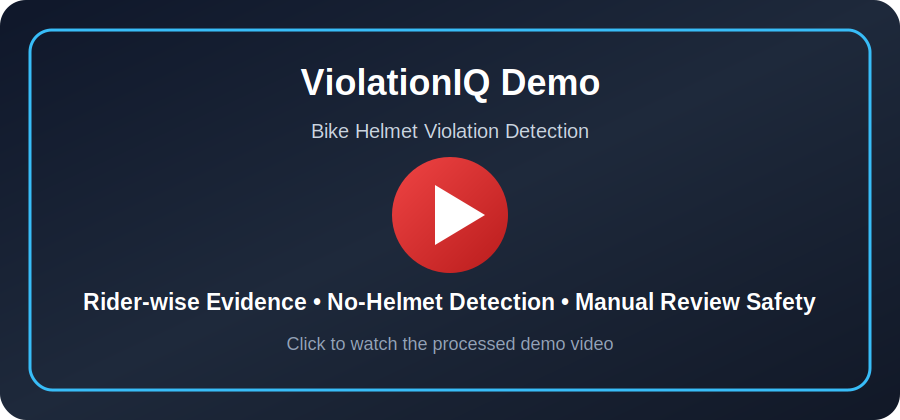

# 🚦 ViolationIQ  

<!-- DEMO_VIDEO_START -->

---

## 🎥 Live Demo Preview

<p align="center">
  <a href="demo/violationiq_bike_helmet_demo.mp4">
    
  </a>
</p>

<p align="center">
  <b>Bike Helmet Violation Detection Demo</b><br>
  Rider-wise helmet evidence • No-helmet detection • Evidence summary • Manual-review safety layer
</p>

<p align="center">
  ▶️ <a href="demo/violationiq_bike_helmet_demo.mp4"><b>Watch Full Processed Demo Video</b></a>
</p>

---

<!-- DEMO_VIDEO_END -->
<!-- DATASET_RESULTS_START -->

---

## 📊 Datasets, Training Setup, and Experimental Results

ViolationIQ uses **task-specific datasets** because real traffic enforcement cannot be handled reliably by one model only. Helmet violation, number plate localization, red-light evidence, and signboard context each require different evidence and different reasoning.

### 🗂️ Datasets Used

| Module | Dataset Used | Purpose | Status |
|---|---|---|---|
| Traffic / Signboard Expert | `guisahanes/traffic-violation-detection-dataset` | Vehicles, traffic lights, traffic signs, no-entry/no-stopping/stop/turn context | Used for traffic/sign context training |
| Helmet + Rider Expert | `aryanvaid13/indian-helmet-detection-dataset` | Rider, helmet, no-helmet, bad-helmet, number-plate classes | Used for helmet/rider training |
| Dedicated Number Plate Expert | Large YOLO plate dataset with `10,125` images | Number plate localization and plate crop extraction | Used for plate detector training |
| Red-Light Evidence Module | `farzadnekouei/license-plate-recognition-for-red-light-violation` | Red-light video evidence, signal color, vehicle crossing and stop-line demo | Used for red-light video demo |
| Uploaded Bike Demo Video | Private uploaded video dataset `Videofbike` | Final processed helmet violation demo video | Used for final demo only, not training |

### 🧠 Models Trained / Used

| Expert Module | Model / Method | What it does |
|---|---|---|
| Traffic Expert | YOLO11s | Detects traffic signs, traffic lights, vehicles, and signboard context |
| Helmet Expert | YOLO11s | Detects riders, helmet, no-helmet, bad helmet, and number plate class from helmet dataset |
| Plate Expert | YOLO11s | Dedicated number plate localization |
| OCR Layer | EasyOCR + validation rules | Reads plate crops only when quality and confidence are acceptable |
| Red-Light Reasoning | YOLO + OpenCV HSV + rule logic | Detects red/green signal, vehicles, stop-line crossing, and temporal evidence |
| Speed Prototype | OpenCV tracking logic | Estimates speed from frame displacement; requires calibration before enforcement |
| Safety Layer | Rule-based decision layer | Sends weak OCR, unclear signal, and calibration-dependent cases to manual review |

### 📈 Experimental Results

| Model / Module | Result |
|---|---|
| Traffic YOLO11s model | mAP50 around `0.928`, mAP50-95 around `0.808` |
| Helmet/Rider YOLO11s model | mAP50 around `0.701`, mAP50-95 around `0.32` |
| Dedicated Plate YOLO11s model | Validation mAP50 around `0.924`, mAP50-95 around `0.548` |
| Plate dataset split | `7057` train images, `2048` validation images, `1020` test images |
| Red-Light Video Module | Generated red-signal + vehicle-crossing evidence with temporal/manual-review safety |
| Uploaded Bike Helmet Demo | Generated processed MP4 demo with rider-wise helmet violation evidence |
| Signboard Context Module | Generated context evidence for no-entry, no-stopping, stop, turn restriction and speed-limit signs |
| Speed Estimation Prototype | Demonstrated tracking-based speed estimation with calibration warning |

### ✅ Claim Audit: What is Fully Implemented vs Prototype

| Feature | README Claim | Actual Status |
|---|---|---|
| Helmet violation detection | Implemented | ✅ Implemented |
| Rider-wise evidence generation | Implemented | ✅ Implemented |
| Dedicated number plate detection | Implemented | ✅ Implemented |
| Safe OCR / ANPR | Implemented with safety | ✅ Implemented with manual-review fallback |
| Red-light video evidence | Implemented | ✅ Implemented as video evidence demo with temporal/manual-review logic |
| Signboard context detection | Implemented | ✅ Implemented as context evidence |
| Speed estimation | Prototype | ✅ Prototype only, calibration required |
| Wrong-side driving | Framework only | ⚠️ Not enforcement-ready; needs direction tracking and road calibration |
| Illegal parking | Framework only | ⚠️ Not enforcement-ready; needs parking-zone and duration tracking |
| Seatbelt violation | Not implemented | ❌ Not implemented; needs cabin/interior dataset |
| Triple riding | Not reliable yet | ⚠️ Not claimed as final; needs stronger multi-person rider dataset |

### 🧾 Final Evidence Outputs

The final project package includes:

| Output Type | Folder |
|---|---|
| Helmet + rider evidence | `outputs/helmet_plate/` |
| Number plate evidence | `outputs/helmet_plate/` and `outputs/final_best/helmet_plate_best/` |
| Red-light evidence | `outputs/redlight/` |
| Signboard context evidence | `outputs/signboard_context/` |
| Speed estimation prototype | `outputs/speed_estimation_demo/` |
| Final selected showcase | `outputs/FINAL_SHOWCASE/` |
| Demo videos | `outputs/video/` and `demo/` |
| Reports | `reports/` |
| Architecture | `architecture/` |

### ⚖️ Safety Position

ViolationIQ is an **AI evidence copilot**, not a blind challan generator.

It does not automatically issue challans when:

- OCR is weak,
- plate is unreadable,
- signal is unclear,
- only single-frame evidence exists,
- camera calibration is missing,
- speed, direction, or duration tracking is required.

Uncertain cases are routed to **manual review**.

---

<!-- DATASET_RESULTS_END -->
## Adaptive Multi-Expert AI Evidence Copilot for Traffic Enforcement

<p align="center">
  <b>Safety-first AI framework for traffic violation evidence generation</b><br>
  Helmet Detection • Number Plate Evidence • Red-Light Video Evidence • Signboard Context • Speed Estimation Prototype
</p>

<p align="center">
  <b>Built for automated photo/video-based traffic violation identification using Computer Vision</b>
</p>

<p align="center">
  
  
  
  
  
</p>

---

## 1. Project Overview

**ViolationIQ** is an adaptive computer-vision based traffic enforcement evidence system.

The goal of this project is not to blindly generate challans. Instead, ViolationIQ works as an **AI Evidence Copilot** that detects possible traffic violations, prepares clean review-ready evidence, attaches number plate information only when reliable, and sends uncertain cases to manual review.

The system is designed for real-world traffic scenes where false challans can happen because of blurry images, wrong OCR, unclear traffic signs, poor lighting, occlusion, camera angle issues, and road-specific geometry.

---

## 2. Problem Statement Alignment

This project is aligned with:

> **Automated Photo Identification and Classification for Traffic Violations Using Computer Vision**

The system focuses on traffic violation evidence generation from images and videos, including:

- helmet violation detection,
- rider-wise evidence generation,
- number plate detection,
- safe OCR / ANPR,
- red-light video evidence,
- signboard context detection,
- speed-estimation prototype,
- structured reports,
- final showcase outputs.

---

## 3. Motivation

Traffic enforcement using cameras is challenging because:

- number plates can be small, blurred, tilted, or partially visible,
- OCR can produce wrong or incomplete plate numbers,
- a single image may show a speed-limit sign, but cannot prove overspeeding,
- red-light violation needs temporal evidence, not only one frame,
- wrong-side driving and illegal parking require tracking over time,
- real CCTV cameras need calibration for stop-lines, signal ROI, direction, zones, and speed estimation,
- a wrong automatic challan can reduce public trust.

Therefore, ViolationIQ uses a **multi-expert, safety-first architecture** instead of a single detector.

---

## 4. Final Project Outcome

ViolationIQ delivers a complete prototype package containing:

| Output | Description |
|---|---|
| Helmet evidence panels | Rider-wise helmet / no-helmet detection outputs |
| Plate evidence | Dedicated number plate detection with safe OCR |
| Red-light evidence | Signal color + vehicle crossing virtual stop-line |
| Signboard context evidence | No-entry, no-stopping, stop sign, turn restriction, speed-limit context |
| Speed estimation prototype | Vehicle speed estimation demo from video with calibration warning |
| Adaptive router | Routes image/video input to the correct module |
| Reports | JSON and CSV evidence reports |
| Architecture | Visual and Mermaid architecture diagrams |
| Final showcase | Best selected outputs for demo and GitHub |
| Source code | Modular source code inside `src/` |

Final selected outputs are available in:

```text
outputs/FINAL_SHOWCASE/
```

---

## 5. Ten Key Deliverables

| No. | Deliverable | Status | Description |
|---|---|---|---|
| 1 | Adaptive Multi-Expert Router | Implemented | Routes input to the correct module based on image/video type and detected scene context. |
| 2 | Helmet + Rider Detection | Implemented | Detects riders and classifies helmet compliance in rider-wise format. |
| 3 | Rider-wise Evidence Generation | Implemented | Generates rider-wise evidence panels with rider-specific status. |
| 4 | Dedicated Number Plate Detection | Implemented | Uses a separate trained plate detector for plate localization. |
| 5 | Safe OCR / ANPR Pipeline | Implemented with safety | Displays plate number only when OCR is reliable; otherwise marks it for manual review. |
| 6 | Red-Light Video Evidence Module | Implemented | Detects signal color, vehicles, virtual stop-line crossing, and temporal evidence. |
| 7 | Signboard Context Module | Implemented | Detects traffic signs such as no-entry, no-stopping, stop sign, speed-limit, and turn restriction signs. |
| 8 | Speed Estimation Prototype | Prototype | Tracks vehicles across frames and estimates speed as a calibration-dependent demo. |
| 9 | Final Showcase Outputs | Implemented | Stores best selected images and videos inside `outputs/FINAL_SHOWCASE/` for demo and GitHub presentation. |
| 10 | Reports, Architecture, and Documentation | Implemented | Includes JSON/CSV reports, architecture diagram, Mermaid diagram, README, config files, and implementation notes. |

---

## 6. Deliverable Coverage Status

| Feature | Status | Evidence Generated |
|---|---|---|
| Helmet violation detection | Implemented | Yes |
| Rider-wise evidence | Implemented | Yes |
| Number plate detection | Implemented | Yes |
| Safe OCR / ANPR | Implemented with manual-review fallback | Yes |
| Red-light video evidence | Implemented | Yes |
| Signboard context detection | Implemented | Yes |
| No-entry context | Implemented as context evidence | Yes |
| No-stopping context | Implemented as context evidence | Yes |
| Speed estimation | Prototype | Demo only |
| Wrong-side driving | Framework only | Needs tracking + road-direction calibration |
| Illegal parking | Framework only | Needs parking-zone definition and duration tracking |
| Seatbelt violation | Not implemented | Needs cabin/interior vehicle dataset |
| Triple riding | Not reliable yet | Needs stronger multi-person rider dataset |

---

## 7. System Approach

ViolationIQ follows a modular pipeline:

```text
Input Image / Video
        |
        v
Adaptive Router
        |
        |-- Helmet + Plate Module
        |-- Red-Light Video Module
        |-- Signboard Context Module
        |-- Speed Estimation Prototype
        |
        v
Evidence Reasoning Layer
        |
        |-- Helmet compliance decision
        |-- Safe plate OCR validation
        |-- Traffic signal + stop-line reasoning
        |-- Signboard context reasoning
        |-- Temporal voting
        |
        v
Safety Layer
        |
        |-- No forced OCR
        |-- Manual review fallback
        |-- Camera calibration requirement
        |-- No unsafe automatic challan
        |
        v
Clean Evidence Panel + JSON/CSV Report
```

---

## 8. Architecture Used

ViolationIQ uses an **Adaptive Multi-Expert Architecture**.

A single object detection model is not sufficient for traffic enforcement because each violation needs a different kind of evidence.

| Violation Type | Why separate handling is needed |
|---|---|
| Helmet violation | Needs rider-wise association between rider and helmet/face. |
| Number plate | Needs dedicated plate localization and OCR validation. |
| Red-light violation | Needs video, signal color, stop-line, and temporal voting. |
| Signboard violation context | Needs traffic sign detection and rule-based context reasoning. |
| Speed violation | Needs tracking and real-world camera calibration. |
| Wrong-side / illegal parking | Needs temporal tracking and camera-specific zone/direction calibration. |

So ViolationIQ separates the system into expert modules and connects them through an adaptive router.

---

## 9. Advanced Architecture Diagram

```text
Input Image / Video
        |
        v
+--------------------------------+
| Adaptive Multi-Expert Router   |
+--------------------------------+
        |
        |-- Helmet + Rider Expert
        |-- Number Plate Expert
        |-- Red-Light Video Expert
        |-- Signboard Context Expert
        |-- Speed Estimation Prototype
        |-- Manual Review for uncertain cases
        |
        v
+--------------------------------+
| Evidence Reasoning Layer       |
+--------------------------------+
| Helmet compliance              |
| Safe OCR validation            |
| Signal + stop-line crossing    |
| Signboard context reasoning    |
| Temporal voting                |
| Speed estimation framework     |
+--------------------------------+
        |
        v
+--------------------------------+
| Safety Layer                   |
+--------------------------------+
| No forced OCR                  |
| Manual review fallback         |
| Camera calibration required    |
| No unsafe automatic challan    |
+--------------------------------+
        |
        v
Clean Evidence Panel + JSON/CSV Report
```

Architecture files:

```text
architecture/violationiq_architecture.png
architecture/architecture_mermaid.md
```

---

## 10. Adaptive Router

The adaptive router decides which module should run.

| Input Type / Scene | Selected Module |
|---|---|
| Video input | Red-Light Video Module |
| Image with riders / helmets / two-wheelers | Helmet + Plate Module |
| Image with traffic signs | Signboard Context Module |
| Unknown or unclear scene | Manual Review / Multi-module review |

Implemented in:

```text
src/adaptive_router.py
config/adaptive_router_config.json
```

---

## 11. Module 1: Helmet + Plate Evidence

This module detects riders and helmet compliance.

It generates:

- total rider count,
- helmet OK count,
- violation count,
- manual review count,
- rider-wise bounding boxes,
- helmet / no-helmet decision,
- plate information if reliable,
- JSON evidence report.

Output folders:

```text
outputs/helmet_plate/
outputs/final_best/helmet_plate_best/
outputs/FINAL_SHOWCASE/helmet_plate/
```

---

## 12. Module 2: Dedicated Number Plate + Safe OCR

ViolationIQ uses a separate number plate detector.

OCR is not forced.

```text
If OCR is reliable:
    Display plate number

If OCR is weak / partial / unreadable:
    Plate: UNREADABLE
    Action: Manual Review
```

This avoids false challans due to wrong plate reading.

The OCR system uses:

- plate crop extraction,
- crop enhancement,
- OCR reading,
- plate text cleaning,
- format validation,
- confidence threshold,
- manual-review fallback.

---

## 13. Module 3: Red-Light Video Evidence

This module works on video evidence.

It detects:

- traffic signal color,
- vehicle objects,
- virtual stop-line crossing,
- possible red-light violation,
- temporal multi-frame evidence.

Output folders:

```text
outputs/redlight/
outputs/final_best/redlight_best/
outputs/video/ and outputs/FINAL_SHOWCASE/redlight/
outputs/FINAL_SHOWCASE/redlight/
```

Important enforcement rule:

> Final challan should not be generated from one frame only. Temporal voting and manual review are required.

---

## 14. Module 4: Signboard Context Evidence

This module detects traffic signs and generates context evidence.

Supported contexts:

- no entry,
- no stopping,
- stop sign,
- no left turn,
- no right turn,
- no u-turn,
- no overtaking,
- red / green signal context,
- speed-limit sign context.

Output folders:

```text
outputs/signboard_context/
outputs/final_best/signboard_best/
outputs/FINAL_SHOWCASE/signboard_context/
```

Important:

> Image-only sign detection gives context. Final challan may require tracking, speed, duration, or manual review.

---

## 15. Module 5: Speed Estimation Prototype

ViolationIQ includes a video-based speed-estimation prototype.

It tracks detected vehicles across video frames and estimates speed from pixel displacement.

Output folders:

```text
outputs/speed_estimation_demo/
outputs/FINAL_SHOWCASE/videos/
```

Important:

> Speed estimation is not enforcement-ready without camera calibration. Real deployment needs homography, pixel-to-meter mapping, lane-wise tracking, and FPS verification.

---

## ## 16. Models Used and Results Summary

| Expert | Model / Method | Purpose |
|---|---|---|
| Traffic Expert | YOLO11s | Vehicles, traffic signs, traffic lights, traffic context |
| Helmet Expert | YOLO11s | Rider, helmet, no-helmet, bad helmet |
| Plate Expert | YOLO11s | Number plate localization |
| OCR | EasyOCR + validation rules | Plate text reading only when reliable |
| Reasoning Layer | Rule-based logic | Manual review, temporal voting, context decision |

### Experimental results recorded during development

| Module | Result |
|---|---|
| Traffic model | mAP50 around `0.928`, mAP50-95 around `0.808` |
| Helmet/rider model | mAP50 around `0.701`, mAP50-95 around `0.32` |
| Dedicated plate model | Validation mAP50 around `0.924`, mAP50-95 around `0.548` |
| Plate dataset | `10,125` images total: `7057` train, `2048` validation, `1020` test |
| Red-light video evidence | Signal color + vehicle crossing + virtual stop-line + temporal/manual-review safety |
| Speed estimation | Prototype only; requires camera calibration before enforcement |

Model weights are not committed to GitHub because they are large. The repository documents expected model names and paths in `models_info/`, `config/`, and the source modules.
17. Repository Structure

```text
ViolationIQ/
|-- README.md
|-- requirements.txt
|
|-- src/
|   |-- adaptive_router.py
|   |-- helmet_plate_module.py
|   |-- redlight_module.py
|   |-- signboard_context_module.py
|   |-- safety_utils.py
|
|-- config/
|   |-- adaptive_router_config.json
|   |-- camera_config.json
|
|-- architecture/
|   |-- violationiq_architecture.png
|   |-- architecture_mermaid.md
|
|-- reports/
|   |-- deliverable_matrix.json
|   |-- final_manifest.json
|   |-- implementation_notes.md
|   |-- speed_estimation_note.json
|
|-- outputs/
|   |-- FINAL_SHOWCASE/
|   |-- helmet_plate/
|   |-- redlight/
|   |-- signboard_context/
|   |-- speed_estimation_demo/
|   |-- video/
|
|-- models_info/
|-- demo/
```

---

## 18. How to Use This Repository

### Step 1: Clone the repository

```bash
git clone https://github.com/Hrithikcrick/ViolationIQ.git
cd ViolationIQ
```

### Step 2: Install dependencies

```bash
pip install -r requirements.txt
```

### Step 3: Check adaptive router demo

```bash
python demo/run_demo.py
```

### Step 4: View final outputs

Open:

```text
outputs/FINAL_SHOWCASE/
```

This folder contains best selected outputs for:

- helmet + plate evidence,
- signboard context evidence,
- red-light evidence,
- speed estimation prototype,
- demo videos.

### Step 5: View reports

Open:

```text
reports/
```

Important files:

```text
reports/final_manifest.json
reports/deliverable_matrix.json
reports/implementation_notes.md
reports/speed_estimation_note.json
```

### Step 6: View architecture

Open:

```text
architecture/violationiq_architecture.png
architecture/architecture_mermaid.md
```

---

## 19. How to Reproduce the Same Pipeline

To reproduce this project from scratch:

1. Prepare datasets for helmet/rider, traffic signs, red-light video, and number plates.
2. Train or load YOLO models for traffic, helmet/rider, and number plate detection.
3. Use the adaptive router to select the correct module.
4. Run helmet + plate module for rider images.
5. Run red-light module for traffic signal videos.
6. Run signboard context module for traffic sign images.
7. Run speed-estimation prototype only when video is available.
8. Generate evidence images, JSON reports, CSV reports, and demo videos.
9. Select best outputs into `outputs/FINAL_SHOWCASE/`.
10. Use manual review for uncertain cases.

---

## 20. Model Weights

Model weights are not pushed directly to GitHub because they are large.

Required trained models:

```text
traffic_yolo11s_best.pt
helmet_yolo11s_best.pt
large_plate_yolo11s_best.pt
```

Recommended storage:

- Kaggle Model,
- Google Drive,
- GitHub Release,
- Hugging Face.

Update model paths in the runtime notebook or inference script before running inference.

---

## 21. Reports Generated

ViolationIQ generates structured outputs for review and analysis.

Report examples:

```text
reports/final_manifest.json
reports/deliverable_matrix.json
reports/implementation_notes.md
reports/speed_estimation_note.json
```

These reports help explain:

- which evidence was generated,
- which module was used,
- whether OCR was reliable,
- whether manual review is required,
- which outputs are selected for final demo.

---

## 22. Why This Project Is Different

ViolationIQ is not just a YOLO detection project.

It adds:

- adaptive expert routing,
- rider-wise evidence,
- safe OCR fallback,
- red-light temporal reasoning,
- signboard context reasoning,
- calibration-aware speed estimation,
- clean reports,
- final showcase packaging,
- safety-first decision logic.

This makes the project more practical for real traffic enforcement scenarios.

---

## <!-- CLAIM_SCOPE_START -->

---

## ✅ Verified Scope of This Repository

This repository intentionally separates **implemented modules**, **prototype modules**, and **framework-only modules**.

| Category | Features |
|---|---|
| Fully demonstrated | Helmet violation evidence, rider-wise panels, number plate localization, safe OCR fallback, red-light video evidence, signboard context, JSON/CSV reports, architecture, final showcase |
| Prototype only | Speed estimation from video using tracking logic |
| Framework only | Wrong-side driving and illegal parking because they require camera-specific direction/zone/duration calibration |
| Not implemented | Seatbelt violation because it requires cabin/interior vehicle dataset |
| Not claimed as final | Triple riding because robust multi-person rider counting needs a stronger dedicated dataset |

This avoids overclaiming and keeps the project practical for real enforcement use.

---

<!-- CLAIM_SCOPE_END -->
23. Safety and Ethics

ViolationIQ is a decision-support system, not an automatic punishment system.

It does not issue direct challans when:

- OCR is weak,
- plate is unreadable,
- signal is unclear,
- only single-frame evidence exists,
- camera calibration is missing,
- speed, direction, or duration tracking is required.

Uncertain evidence is routed to:

```text
Manual Review
```

---

## 24. Final Deliverable Summary

This repository contains:

- source code,
- adaptive router,
- config files,
- architecture diagram,
- final showcase outputs,
- red-light demo video,
- speed-estimation demo video,
- helmet + plate evidence examples,
- signboard context examples,
- JSON / CSV reports,
- model documentation,
- implementation notes.

---

## 25. Final Claim

**ViolationIQ** is an adaptive multi-expert AI evidence copilot for traffic enforcement that produces clean, review-ready, safety-aware evidence for helmet violations, number plate context, red-light violations, traffic sign contexts, and calibrated speed-estimation prototypes.

It is designed to support enforcement teams with strong evidence generation while reducing unsafe automatic decisions.


