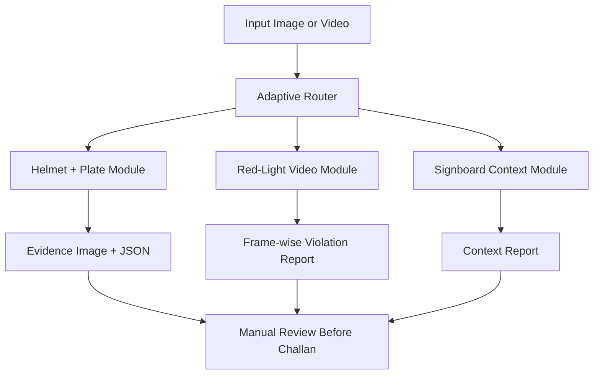

# ViolationIQ Architecture

```mermaid
flowchart TD
    A[Input Image or Video] --> B[Adaptive Router]
    B --> C[Helmet + Plate Module]
    B --> D[Red-Light Video Module]
    B --> E[Signboard Context Module]
    C --> F[Evidence Image + JSON]
    D --> G[Frame-wise Violation Report]
    E --> H[Context Report]
    F --> I[Manual Review Before Challan]
    G --> I
    H --> I
```
