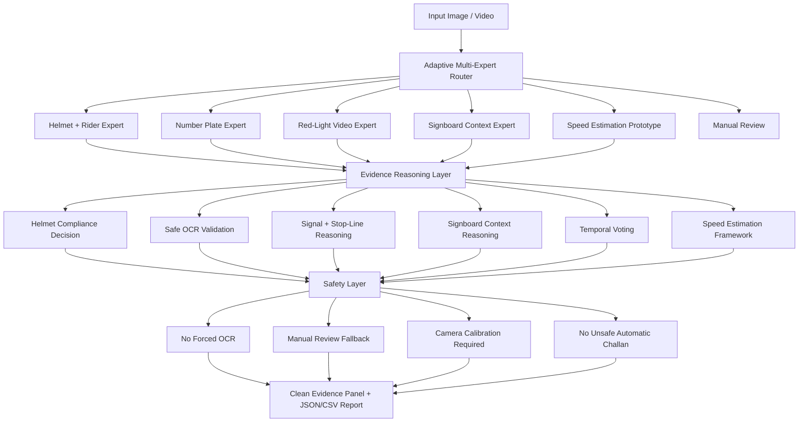

# ViolationIQ Advanced Architecture

```mermaid
flowchart TD
    A[Input Image / Video] --> B[Adaptive Multi-Expert Router]

    B --> C[Helmet + Rider Expert]
    B --> D[Number Plate Expert]
    B --> E[Red-Light Video Expert]
    B --> F[Signboard Context Expert]
    B --> G[Speed Estimation Prototype]
    B --> H[Manual Review]

    C --> I[Evidence Reasoning Layer]
    D --> I
    E --> I
    F --> I
    G --> I

    I --> J[Helmet Compliance Decision]
    I --> K[Safe OCR Validation]
    I --> L[Signal + Stop-Line Reasoning]
    I --> M[Signboard Context Reasoning]
    I --> N[Temporal Voting]
    I --> O[Speed Estimation Framework]

    J --> P[Safety Layer]
    K --> P
    L --> P
    M --> P
    N --> P
    O --> P

    P --> Q[No Forced OCR]
    P --> R[Manual Review Fallback]
    P --> S[Camera Calibration Required]
    P --> T[No Unsafe Automatic Challan]

    Q --> U[Clean Evidence Panel + JSON/CSV Report]
    R --> U
    S --> U
    T --> U
```
