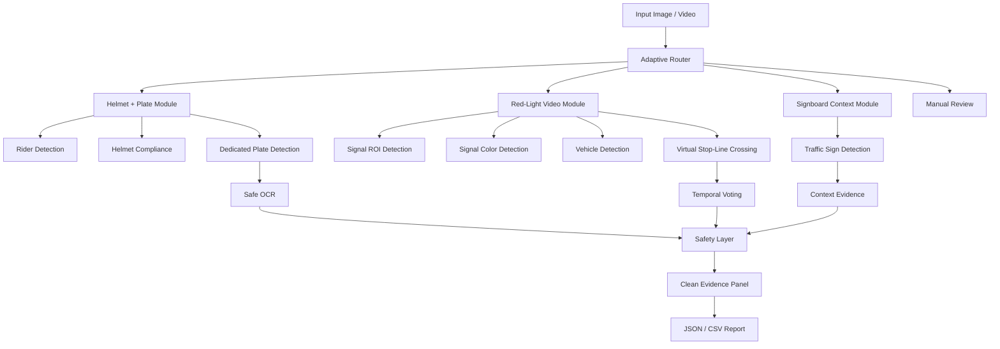

# ViolationIQ Architecture Mermaid Diagram

```mermaid
flowchart TD
    A[Input Image / Video] --> B[Adaptive Router]
    B --> C[Helmet + Plate Module]
    B --> D[Red-Light Video Module]
    B --> E[Signboard Context Module]
    B --> F[Manual Review]
    C --> C1[Rider Detection]
    C --> C2[Helmet Compliance]
    C --> C3[Dedicated Plate Detection]
    C3 --> C4[Safe OCR]
    D --> D1[Signal ROI Detection]
    D --> D2[Signal Color Detection]
    D --> D3[Vehicle Detection]
    D --> D4[Virtual Stop-Line Crossing]
    D4 --> D5[Temporal Voting]
    E --> E1[Traffic Sign Detection]
    E1 --> E2[Context Evidence]
    C4 --> G[Safety Layer]
    D5 --> G
    E2 --> G
    G --> H[Clean Evidence Panel]
    H --> I[JSON / CSV Report]
```